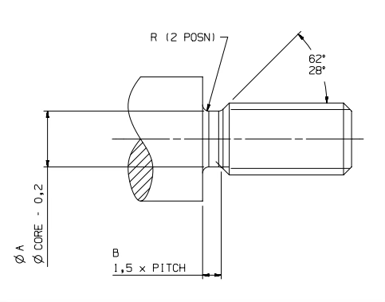
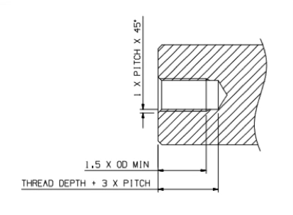

# Threads

## External Threads

| Thread | Pitch [mm] | A [mm] | B [mm] | R [mm] | End Chamfer [mm] | Clearance Drill [mm] |
|---|---:|---:|---:|---:|---:|---:|
| M2.0 | 0.40 | 1.30 | 0.60 | 0.2 | 0.35 | 2.05 |
| M2.5 | 0.45 | 1.80 | 0.70 | 0.2 | 0.35 | 2.60 |
| M3 | 0.50 | 2.20 | 0.75 | 0.2 | 0.40 | 3.10 |
| M4 | 0.70 | 2.90 | 1.10 | 0.4 | 0.55 | 4.10 |
| M5 | 0.80 | 3.70 | 1.20 | 0.4 | 0.65 | 5.10 |
| M6 | 1.00 | 4.40 | 1.50 | 0.6 | 0.80 | 6.10 |
| M8 | 1.25 | 6.00 | 1.90 | 0.6 | 1.00 | 8.20 |
| M10 | 1.50 | 7.70 | 2.25 | 0.8 | 1.15 | 10.20 |
| M12 | 1.75 | 9.40 | 2.65 | 1.0 | 1.30 | 12.20 |

> BS:1936-2:1991

## Internal Threads

| Thread | Pitch [mm] | Tap Drill [mm] | Max Depth [mm] |
|---|---:|---:|---:|
| M2.0 | 0.40 | 1.60 | 5.0 |
| M2.5 | 0.45 | 2.05 | 6.0 |
| M3 | 0.50 | 2.50 | 7.5 |
| M4 | 0.70 | 3.30 | 10.0 |
| M5 | 0.80 | 4.20 | 12.5 |
| M6 | 1.00 | 5.00 | 15.0 |
| M8 | 1.25 | 7.00 | 20.0 |
| M10 | 1.50 | 8.50 | - |
| M12 | 1.75 | 10.20 | - |

## Typical Screw Torques
### Machine Screws 
| Screw Size | Recommended Torque [Nm] | Approximate Load [N] | Maximum Torque [Nm] | Approximate Max Load [N] |
|---|---:|---:|---:|---:|
| M1.6 | 0.15 | 480 | 0.25 | 950 |
| M2.0 | 0.30 | 775 | 0.50 | 1550 |
| M2.5 | 0.65 | 1400 | 1.00 | 2550 |
| M3 | 1.10 | 2100 | 1.80 | 4000 |
| M4 | 2.60 | 3800 | 4.00 | 7100 |
| M5 | 5.10 | 6000 | 8.00 | 11600 |
| M6 | 8.30 | 8100 | 14.00 | 16400 |
| M8 | 21.00 | 15500 | 43.00 | 30200 |
| M10 | 41.00 | 24300 | 67.00 | 48000 |

### Grub Screws
| Screw Size | Recommended Torque [Nm] | Approximate Axial Holding Force [N] | Maximum Torque [Nm] |
|---|---:|---:|---:|
| M2.0 | 0.15 | 310 | 0.20 |
| M2.5 | 0.30 | 530 | 0.50 |
| M3 | 0.65 | 850 | 0.87 |
| M4 | 1.10 | 1400 | 2.20 |
| M5 | 2.60 | 2100 | 4.60 |
| M6 | 5.10 | 4600 | 7.80 |
| M8 | 8.30 | 200 | 18.00 |
| M10 | 21.00 | 310 | 36.00 |
